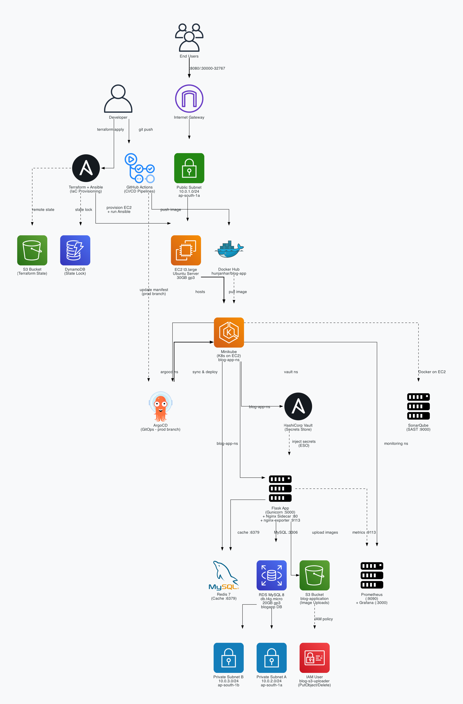
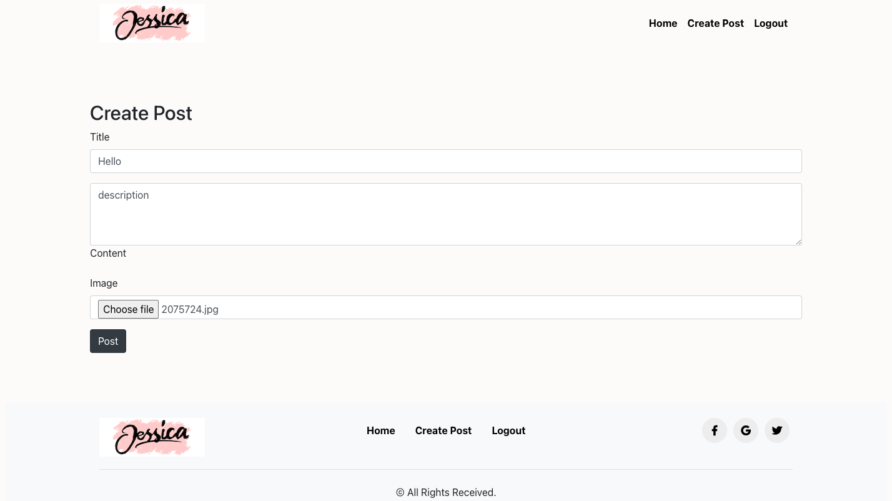
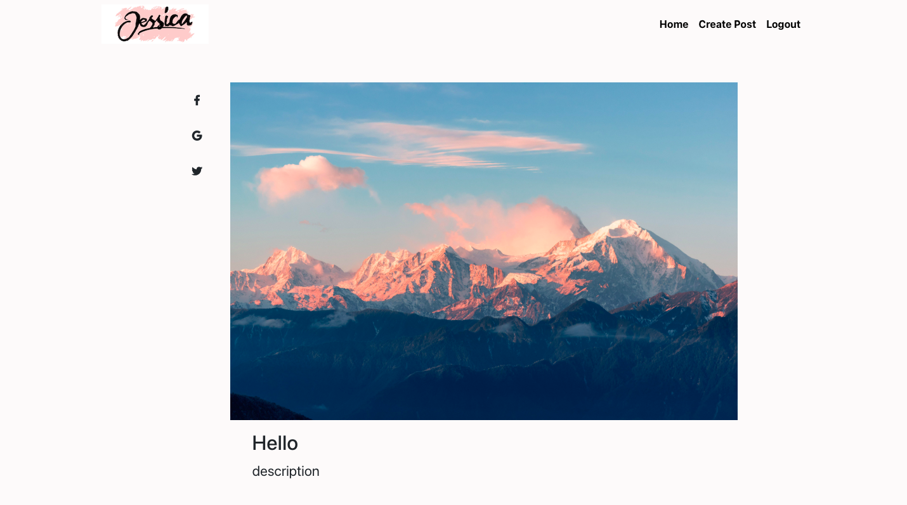

# Blog Application

A production-grade Flask blog application deployed on **AWS EC2 (ap-south-1)** running **Minikube** as the Kubernetes runtime. The full stack includes CI/CD via GitHub Actions, GitOps with ArgoCD, secrets management via HashiCorp Vault + External Secrets Operator, and observability via Prometheus + Grafana.

---

## Architecture Overview



---

## Application Layout





---

## Project Structure

```
blog-app/
├── app/                        # Flask application source
├── templates/                  # Jinja2 HTML templates
├── static/                     # CSS, images, uploaded files
├── k8s/
│   └── prod-deployment/        # Kubernetes manifests (ArgoCD source)
│       ├── app-deployment.yml  # Flask + Nginx + nginx-exporter pod
│       ├── redis-deployment.yml
│       ├── app-service.yml     # NodePort service
│       ├── redis-service.yml
│       ├── app-pvc.yml         # PVC for uploads
│       ├── storage-pvc.yml
│       ├── app-scaling.yml     # HPA config
│       ├── secret-store.yml    # Vault SecretStore
│       ├── external-secrets.yml# ExternalSecret → Vault mapping
│       ├── service-monitor.yml # Prometheus ServiceMonitor
│       ├── namespace.yml
│       └── kustomization.yml
├── argocd-config/
│   ├── argocd.yml              # ArgoCD Application manifest
│   └── argocd-monitor.yml      # ArgoCD monitoring config
├── terraform/                  # AWS infrastructure as code
│   ├── provider.tf
│   ├── terraform.tf
│   ├── vpc.tf                  # VPC, subnets, IGW, route tables
│   ├── main.tf                 # EC2 instance + security group
│   ├── rds.tf                  # RDS MySQL 8 instance
│   ├── s3.tf                   # S3 bucket + IAM user/policy
│   ├── resources.tf            # Ansible inventory + null_resource trigger
│   ├── output.tf               # Outputs: IP, DB creds, S3 info
│   ├── terraform-backup.tf     # Remote state backend reference
│   ├── inventary.tpl           # Ansible inventory template
│   └── playbooks/
│       └── roles/config/
│           └── tasks/main.yml  # Full EC2 provisioning tasks
├── remote-infa/                # Terraform remote state backend
├── .github/workflows/          # GitHub Actions workflows
│   ├── ci-notify.yml           # CI orchestrator + notifications
│   ├── cd-notify.yml           # CD orchestrator + notifications
│   ├── build.yml               # Docker build + Trivy scan + DockerHub push
│   ├── deploy.yml              # Vault inject + ArgoCD manifest apply
│   ├── test.yml                # Pytest runner
│   ├── security.yml            # TruffleHog + SonarQube
│   ├── argocd.yml              # ArgoCD sync workflow
│   └── deploy-main.yml         # Main branch deploy
├── Dockerfile                  # Multi-stage app image
├── docker-compose.yml          # Local dev stack
├── default.conf                # Nginx config
├── .python-version             # Specific version of python
└── requirements.txt            # Python dependencies
```

---

## Application

### Features

- **Admin-only blog**: Only the first registered user is admin; subsequent registrations are blocked
- **Post management**: Create posts with image uploads (stored in S3)
- **Redis caching**: Post list cached for 5 minutes; cache invalidated on new post creation
- **Session auth**: Flask-Login with Werkzeug password hashing

---

### Environment Variables

| Variable | Description |
|---|---|
| `SECRET_KEY` | Flask session secret |
| `MYSQL_HOST` | RDS endpoint (from Terraform output) |
| `MYSQL_USER` | DB username |
| `MYSQL_PASSWORD` | DB password (from Terraform output) |
| `MYSQL_DB` | Database name (`blogapp`) |
| `REDIS_HOST` | Redis service host |
| `REDIS_PORT` | Redis port (default: `6379`) |
| `AWS_BUCKET_NAME` | S3 bucket name |
| `AWS_ACCESS_KEY_ID` | IAM uploader access key |
| `AWS_SECRET_ACCESS_KEY` | IAM uploader secret key |
| `AWS_REGION` | AWS region (default: `ap-south-1`) |
| `AWS_BUCKET_URL` | Public S3 base URL |
| `DOCKERHUB_USERNAME` | Docker Hub username |
| `DOCKERHUB_TOKEN` | Docker Hub access token |
| `VAULT_TOKEN` | HashiCorp Vault root token |
| `SSH_PRIVATE_KEY` | EC2 SSH private key (for CI/CD) |
| `REPO_TOKEN` | GitHub PAT (for manifest push) |
| `SONAR_HOST_URL` | SonarQube server URL |
| `SONAR_TOKEN` | SonarQube user token |

---

## License

See [LICENCE](./LICENCE).
